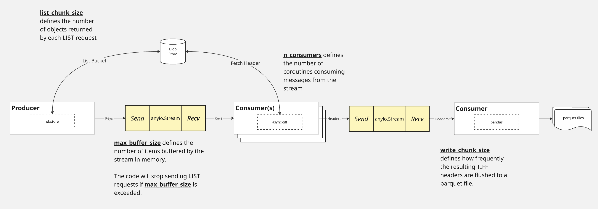

# tiff-dumper

Dump TIFF headers into `.parquet` files using `obstore` and `async-tiff`:
1. List a bucket.
2. Fetch and parse the header of each TIFF we find.
3. Save the headers to parquet.

This library can process ~4,000 images per second with a single python thread (managing multiple rust threads).  

## Usage

The library provides a CLI which accepts a YAML config file, see [config.yaml](./config.yaml) for an example.

```shell
❯ pip install tiff-dumper
❯ mkdir outputs
❯ tiff-dumper headers config.yaml outputs
```

The output parquet files have the following schema:

```shell
│ COLUMN                     │ TYPE   │ ANNOTATION │ REPETITION │ COMPRESSION │
├────────────────────────────┼────────┼────────────┼────────────┼─────────────┤
│ artist                     │ int32  │ null       │ 0..1       │ snappy      │
│ bits_per_sample            │        │ list       │ 0..1       │             │
│ compression                │ int64  │            │ 0..1       │ snappy      │
│ copyright                  │ int32  │ null       │ 0..1       │ snappy      │
│ date_time                  │ int32  │ null       │ 0..1       │ snappy      │
│ document_name              │ int32  │ null       │ 0..1       │ snappy      │
│ extra_samples              │ int32  │ null       │ 0..1       │ snappy      │
│ host_computer              │ int32  │ null       │ 0..1       │ snappy      │
│ image_description          │ int32  │ null       │ 0..1       │ snappy      │
│ image_height               │ int64  │            │ 0..1       │ snappy      │
│ image_width                │ int64  │            │ 0..1       │ snappy      │
│ jpeg_tables                │ int32  │ null       │ 0..1       │ snappy      │
│ max_sample_value           │ int32  │ null       │ 0..1       │ snappy      │
│ min_sample_value           │ int32  │ null       │ 0..1       │ snappy      │
│ model_pixel_scale          │        │ list       │ 0..1       │             │
│ model_tiepoint             │        │ list       │ 0..1       │             │
│ new_subfile_type           │ int32  │ null       │ 0..1       │ snappy      │
│ orientation                │ int32  │ null       │ 0..1       │ snappy      │
│ other_tags                 │        │ group      │ 0..1       │             │
│ photometric_interpretation │ int64  │            │ 0..1       │ snappy      │
│ planar_configuration       │ int64  │            │ 0..1       │ snappy      │
│ predictor                  │ int64  │            │ 0..1       │ snappy      │
│ resolution_unit            │ int32  │ null       │ 0..1       │ snappy      │
│ rows_per_strip             │ int32  │ null       │ 0..1       │ snappy      │
│ sample_format              │        │ list       │ 0..1       │             │
│ samples_per_pixel          │ int64  │            │ 0..1       │ snappy      │
│ software                   │ int32  │ null       │ 0..1       │ snappy      │
│ tile_height                │ int64  │            │ 0..1       │ snappy      │
│ tile_width                 │ int64  │            │ 0..1       │ snappy      │
│ x_resolution               │ int32  │ null       │ 0..1       │ snappy      │
│ y_resolution               │ int32  │ null       │ 0..1       │ snappy      │
│ geokeys                    │        │ group      │ 0..1       │             │
│ path                       │ binary │ string     │ 0..1       │ snappy      │
├────────────────────────────┼────────┴────────────┴────────────┴─────────────┤
│ Rows                       │ 4329                                           │
│ Row Groups                 │ 1                                              │
```

## Performance

The [config file](./config.yaml) checked into the repo lists 235,639 TIFFs and takes 58 seconds on a `m5.8xlarge`, coming out to ~4,000 TIFF headers per second.


## Why is this so fast?

The library uses `anyio` streams to efficiently move data between coroutines.  Each stream has a sending end, and a receivine end; which when combined act as a "bounded queue".  Keys are placed onto the stream as we scan the bucket, and are processed by `N` number of consumers listening to the stream.  Each consumer (a python coroutine) is responsbile for fetching/parsing the TIFF header and placing the results on the output stream.  A single coroutine listens to the output stream and writes the outputs to parquet.

This provides decoupling between listing the bucket, reading/parsing TIFF headers, and writing to parquet; allowing these things to scale independendently of each other.  This decoupling allows us to more efficiently saturate the host machine's network bandwidth compared to the simpler approach of processing each page of LIST requests as we receive them (ex. with `asyncio.gather`).

The diagramn below shows the high-level architecture:


